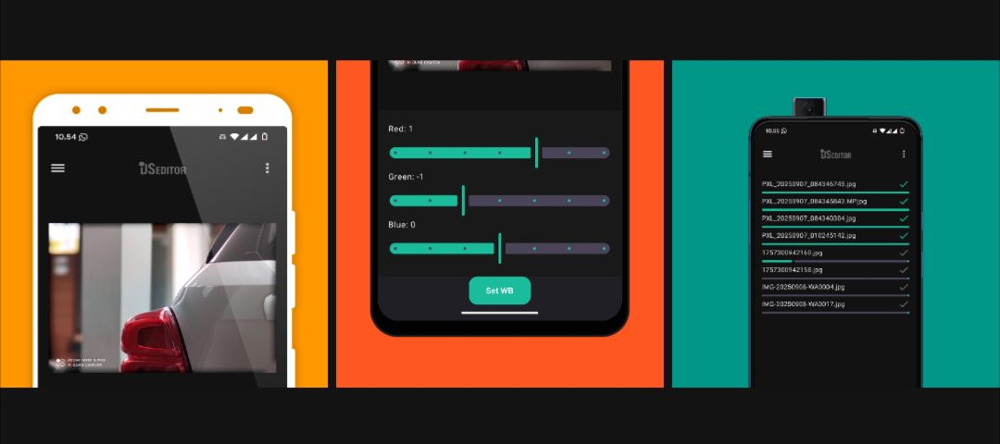

DS-Editor
A photo editor designed to normalize images affected by lens shading artifacts commonly found on external lens modified smartphones (direct sensor mods).

DS-Editor works by applying flatfield-based correction to reduce uneven color distribution, vignetting, and shading caused by the mismatch between the smartphone sensor calibration and external lenses such as DSLR, mirrorless, CCTV, or telescope lenses.

This application is intended for experimental photography setups and direct sensor modification projects, where the original smartphone lens has been removed or replaced.

License & Usage

This application is provided free of charge for personal and non-commercial use only. All rights are reserved by the developer.

You may not:

Modify or reverse engineer the application
Redistribute the APK without permission
Reupload the APK to other websites or platforms
Sell the application or any modified version of it
Use any part of the application for commercial purposes without authorization

The application is distributed “as is”, without warranties or guarantees of any kind. The developer is not responsible for any damage, data loss, device malfunction, or incompatibility resulting from the use of this software.

Security Disclaimer

For security reasons, please ensure that you only download DS-Editor from the official sources provided by the developer.

APK files obtained from unofficial mirrors, third-party websites, or modified distributions may contain malware, spyware, or harmful modifications. Such versions are not supported and may compromise your device or personal data.

Always verify that you are using the original and unmodified release version.
